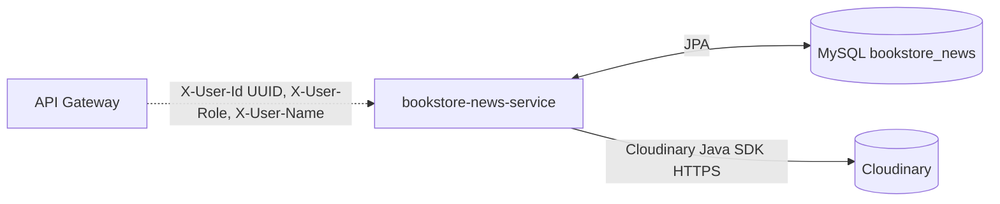

# Chi tiết dependency — `bookstore-news-service`

Tài liệu này mô tả **các dependency** mà `bookstore-news-service` sử dụng khi chạy: **MySQL (JPA)**, **Cloudinary (HTTP SDK)**, và **hợp đồng header** từ API Gateway. Service này **không** gọi OpenFeign sang microservice Bookstore khác trong scope hiện tại (không có `@FeignClient` trong code).

Nguồn đối chiếu trong repo:

- News-service: [CloudinaryImageServiceImpl.java](src/main/java/com/notfound/newsservice/service/impl/CloudinaryImageServiceImpl.java), [CloudinaryConfig.java](src/main/java/com/notfound/newsservice/config/CloudinaryConfig.java), [NewsServiceImpl.java](src/main/java/com/notfound/newsservice/service/impl/NewsServiceImpl.java)
- Monolithic (tham khảo News + Cloudinary): [monolithic/DHKTPM18B_NotFound_WebSiteBanSach-deploy/src/main/java/com/notfound/bookstore/model/entity/News.java](../../monolithic/DHKTPM18B_NotFound_WebSiteBanSach-deploy/src/main/java/com/notfound/bookstore/model/entity/News.java)
- Kiến trúc: [ai-agent/context/architecture.md](../../ai-agent/context/architecture.md)

> **Lưu ý**: Public REST của news-service là **`/api/v1/news/**`** ([NewsController.java](src/main/java/com/notfound/newsservice/controller/NewsController.java)). Gateway cần route khớp prefix này.

---

## 0) Tổng quan luồng phụ thuộc



| Dependency | Loại | Mục đích |
| --- | --- | --- |
| **MySQL 8** | JDBC / Hibernate | Persist `news`, `news_images`, thống kê, search |
| **Cloudinary** | SDK gọi HTTPS (`cloudinary-http44`) | Upload / xoá ảnh tin tức |
| **RabbitMQ** | Có trong `pom.xml` | **Chưa dùng** trong scope hiện tại |

---

## 1) MySQL (`bookstore_news`) — Database per service

### 1.1 Kết nối

- **Driver**: `mysql-connector-j` (runtime)
- **JDBC URL** (ví dụ local): `jdbc:mysql://localhost:3306/bookstore_news?...`
- **DDL**: `spring.jpa.hibernate.ddl-auto` thường `update` trong compose/dev

### 1.2 Entity & ID (UUID)

- `News.id`, `NewsImage.id`: `@UuidGenerator` + `UUID` — Hibernate map mặc định (tương thích monolith, không ép `columnDefinition` trong entity).
- `News.authorId`: `UUID` — snapshot user từ header `X-User-Id` khi tạo tin (không join sang user-service).

**Không có** foreign key sang `user-service` / `book-service` (đúng pattern “database per service”).

---

## 2) Cloudinary — Upload / xoá ảnh (dependency bên ngoài)

Service dùng bean `Cloudinary` ([CloudinaryConfig.java](src/main/java/com/notfound/newsservice/config/CloudinaryConfig.java)) với biến môi trường:

| Biến | Mô tả |
| --- | --- |
| `CLOUDINARY_CLOUD_NAME` | Cloud name |
| `CLOUDINARY_API_KEY` | API key |
| `CLOUDINARY_API_SECRET` | API secret |

Mapping Spring Boot (yaml): `cloudinary.cloud-name`, `cloudinary.api-key`, `cloudinary.api-secret`.

### 2.1 Upload (SDK — không phải REST do team tự định nghĩa path)

- **Gọi trong code**: `cloudinary.uploader().upload(bytes, { folder, resource_type })`
- **Folder mặc định** khi upload news: `bookstore/news` (xem `uploadNewsImages` trong `NewsServiceImpl`).

**Kết quả trả về** (kiểu `Map<String,Object>`) — các key **news-service đang dùng**:

| Key | Kiểu | Ý nghĩa |
| --- | --- | --- |
| `url` | string | URL công khai để lưu vào `NewsImage.url` |
| `public_id` | string | Định danh Cloudinary (dùng khi destroy) |
| `resource_type` | string | Thường `image` / `auto` |

Ví dụ (rút gọn):

```json
{
  "url": "https://res.cloudinary.com/demo/image/upload/v1234567890/bookstore/news/abc.jpg",
  "public_id": "bookstore/news/abc",
  "resource_type": "image"
}
```

### 2.2 Fallback khi chưa cấu hình Cloudinary

Nếu thiếu credential hợp lệ:

- Log cảnh báo
- Trả map placeholder: `url` trỏ `https://placehold.co/...`, `placeholder: true`

→ Tin vẫn tạo được; ảnh chỉ là placeholder (phù hợp dev local).

### 2.3 Xoá ảnh (`destroy`)

- **Gọi trong code**: `cloudinary.uploader().destroy(publicId, ...)`
- `publicId` được suy ra từ `NewsImage.url` bằng parser `/upload/` trong [CloudinaryImageServiceImpl](src/main/java/com/notfound/newsservice/service/impl/CloudinaryImageServiceImpl.java).

**Lưu ý**: URL placeholder (placehold.co) **không** phải Cloudinary URL — `extractPublicId` có thể fail → delete bỏ qua an toàn.

---

## 3) API Gateway — Header tin cậy (ADR-006)

News-service **không** validate JWT; tin cậy header:

| Header | Kiểu | Endpoint cần | Ghi chú |
| --- | --- | --- | --- |
| `X-User-Id` | UUID string | `POST /api/v1/news`, `my-news`, … | `requireUserId()` |
| `X-User-Role` | string | CRUD admin, publish, statistics, upload ảnh | `ROLE_ADMIN` |
| `X-User-Name` | string (optional) | `POST /api/v1/news` | Lưu `authorName` / hiển thị |

Sai định dạng UUID ở `X-User-Id` → **401**.

---

## 4) Public REST của chính news-service (để team khác gọi — không phải dependency đi ra)

Các client (FE, gateway) gọi vào news-service, ví dụ:

| Method | Path | Auth |
| --- | --- | --- |
| `GET` | `/api/v1/news`, `/api/v1/news/published`, `/api/v1/news/{id}`, … | Public / tuỳ endpoint |
| `POST` | `/api/v1/news` | Admin + `X-User-Id` |
| `POST` | `/api/v1/news/{newsId}/images` | Admin + multipart |

Response bọc [ApiResponse](src/main/java/com/notfound/newsservice/model/dto/response/ApiResponse.java): `{ code, message, result }`.

Chi tiết curl: xem [README_news_service.md](README_news_service.md) trong cùng thư mục service.

---

## Notes khi vận hành / mở rộng

- **Jsoup**: chỉ xử lý HTML nội bộ, không phải dependency mạng bắt buộc runtime (trừ khi content chứa URL ngoài do user nhập).
- Nếu sau này news-service cần enrich user/book: lúc đó mới thêm Feign client tương tự cart-service và bổ sung tài liệu dependency mới.
- Cloudinary rate limit / quota: nên monitor; upload lớn bị giới hạn bởi `spring.servlet.multipart.max-file-size` (hiện cấu hình 10MB/file trong yaml).
